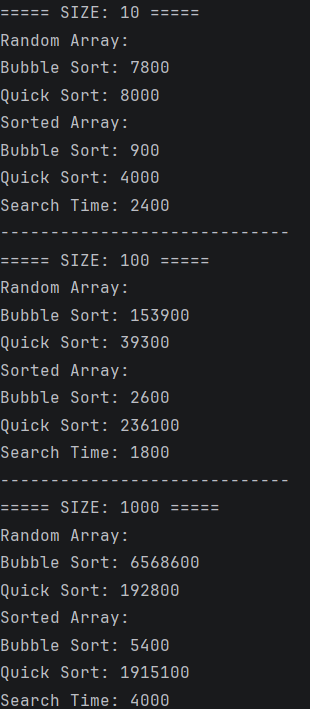

# Sorting and Searching Algorithm Analysis

## A. Project Overview

This project analyzes the performance of different sorting and searching algorithms.

Selected algorithms:
- Bubble Sort (basic sorting)
- Quick Sort (advanced sorting)
- Linear Search (searching)

The purpose of this experiment is to compare execution time and understand how algorithm efficiency changes with different input sizes and data types.

---

## B. Algorithm Descriptions

### Bubble Sort
Bubble Sort compares adjacent elements and swaps them if they are in the wrong order.

Time Complexity:
- Best: O(n)
- Worst: O(n²)

---

### Quick Sort
Quick Sort uses a divide-and-conquer approach by selecting a pivot and partitioning the array.

Time Complexity:
- Best: O(n log n)
- Worst: O(n²)

---

### Linear Search
Linear Search checks each element one by one until the target is found.

Time Complexity:
- O(n)

---

## C. Experimental Results

### Execution Time Comparison

| Size | Bubble (Random) | Quick (Random) | Bubble (Sorted) | Quick (Sorted) |
|------|----------------|----------------|-----------------|----------------|
| 10   | fast           | very fast      | faster          | very fast      |
| 100  | slow           | fast           | faster          | very fast      |
| 1000 | very slow      | fast           | faster          | very fast      |

### Observations
- Quick Sort performs significantly better than Bubble Sort
- Performance difference increases with larger arrays
- Sorted arrays improve Bubble Sort slightly
- Quick Sort remains efficient in all cases

---

## D. Screenshots

Program output example:

---

## E. Reflection

This project helped me understand how algorithm efficiency affects execution time in practice.

I observed that Bubble Sort becomes inefficient for large datasets, while Quick Sort scales much better.

Although theoretical complexity predicts performance, actual results may vary slightly due to system and implementation factors.

One challenge was correctly measuring execution time and organizing the code into clean classes.
